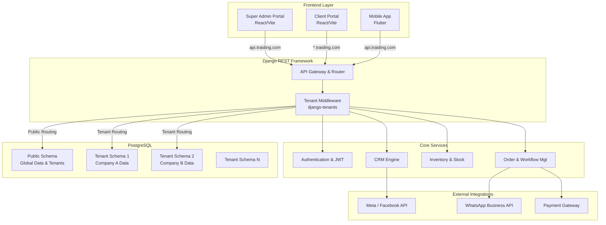

# 1. System Architecture Diagram

This architecture provides a scalable, one-to-many SaaS model. It separates responsibilities between the Super Admin provider and individual Client Tenants. 

## High-Level Architecture

## Key Components

1. **Frontend Layer**: 
   - **Super Admin Portal**: Used by the platform owner to manage subscriptions, create tenants, and define which modules a tenant can access. 
   - **Client Portal**: A separate React app accessed via subdomains (e.g., `company1.traiding.com`). This is where clients configure their own roles, employees, and workflows.
   - **Mobile App**: A unified Flutter application that dynamically enables/disables modules based on the logged-in tenant's configuration.

2. **API & Middleware Layer**:
   - The Django application relies on `django-tenants`. The `TenantMainMiddleware` inspects the incoming request subdomain and routes it to the correct PostgreSQL schema.
   
3. **Database Layer**:
   - **Public Schema**: Contains shared models exclusively (e.g., `Tenant`, `Domain`, `Global Subscription Plans`).
   - **Tenant Schemas**: Fully isolated schemas created automatically per client. Contains all business logic models (`Product`, `Order`, `Invoice`, `User Profiles`, etc.). Data cannot bleed between tenants.
