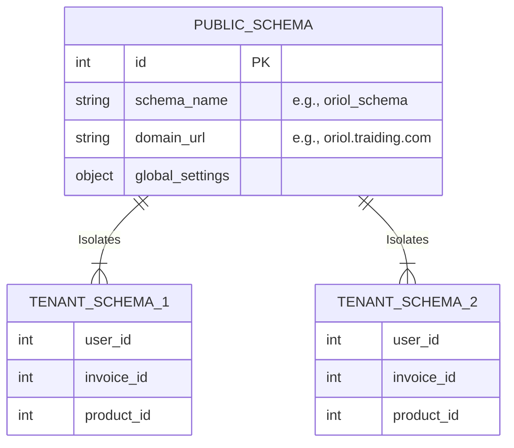

# 2. Multi-Tenant Database Design

The Traiding platform uses PostgreSQL with `django-tenants`. Instead of adding a `tenant_id` foreign key to every single row (Row-Level Security) or using separate databases (Physical Segregation), this project implements **Schema-Level Isolation**.

## Architecture Overview

## 1. The Public Schema (`public`)

The public schema stores data that is **shared across all tenants** and is accessible primarily via the Super Admin portal. 

### Key Shared Models (`SHARED_APPS`)
- `Tenant`: Represents the client company (Name, Subdomain, Created Date, Active Status, Subscription).
- `Domain`: Subdomain routing tied to the `Tenant`.
- `TenantModuleConfig`: Which modules (CRM, Warehouse, etc.) are globally enabled for a specific `Tenant`.
- `SuperAdminUser`: Global admin users managing the platform.

## 2. The Tenant Schemas (e.g., `tenant_oriol`, `tenant_happy_kid`)

Every time a new `Tenant` is created, `django-tenants` automatically generates a new PostgreSQL schema for them. This provides strong data security. Data in `tenant_oriol` cannot be queried from `tenant_happy_kid`.

### Key Tenant Models (`TENANT_APPS`)
- **Authentication**: `User` (Client Admin and Employees), `Role`, `Permission`.
- **CRM**: `Lead`, `Customer`, `ActivityLog`.
- **Inventory**: `Product`, `Warehouse`, `StockMovements`.
- **Sales**: `Order`, `Invoice`, `DispatchSticker`.

## Benefits of this Design

1. **Security**: Strong isolation between client companies. No risk of accidental query leakage exposing Company A's invoices to Company B.
2. **Scalability**: Can handle thousands of tenants. Backups can be done per-schema if a specific client needs a data export.
3. **Simplicity**: Django ORM queries (`Product.objects.all()`) don't need `.filter(tenant_id=request.tenant.id)` appended everywhere. The middleware routes the entire connection to the correct schema.
